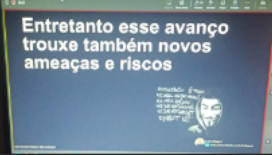
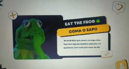
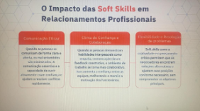
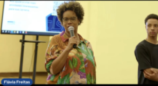
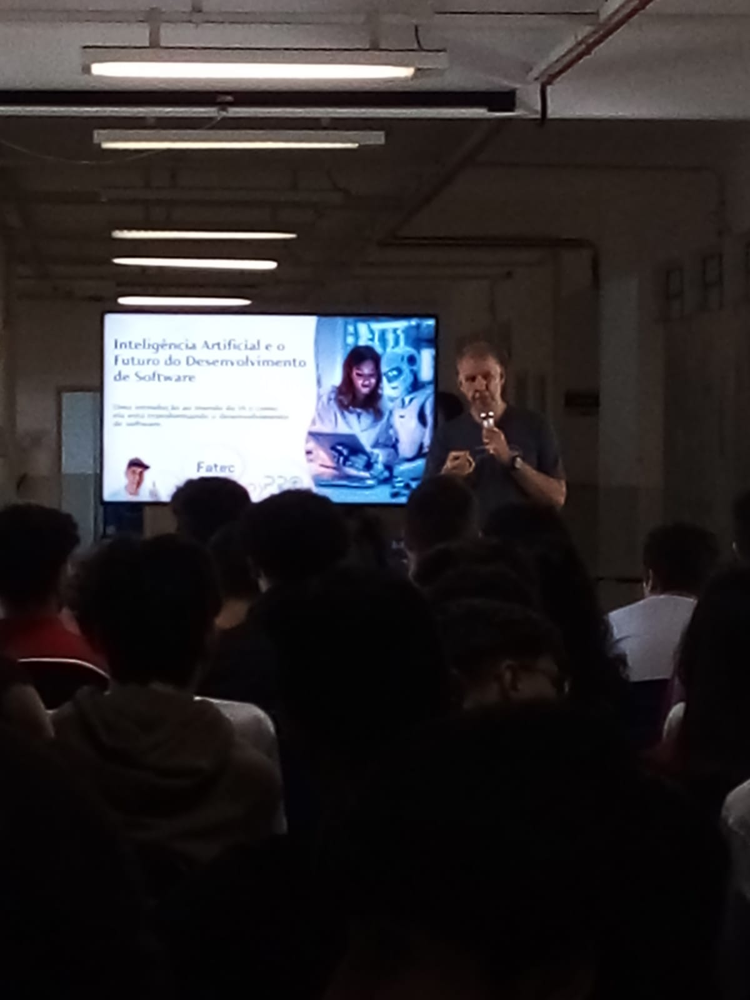
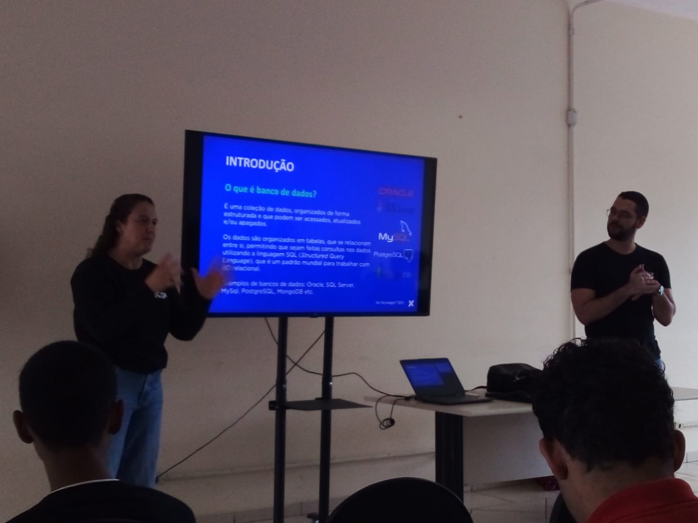
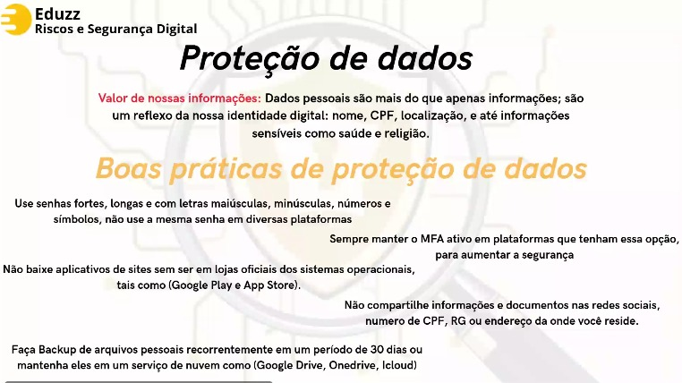
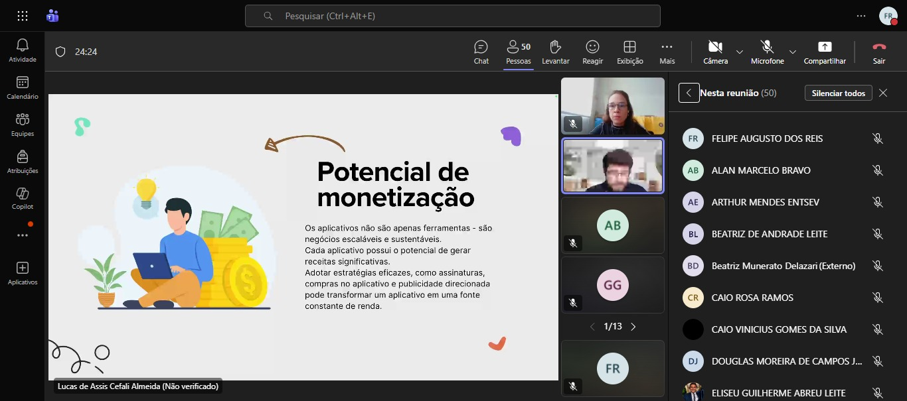

<h1 align="center">
   
</h1>

---

## Sobre este Portfólio
Este repositório é meu registro pessoal das **palestras que participei ao longo do Ensino Médio**.  
Aqui você encontrará:
- Datas das palestras  
- Nome dos palestrantes  
- Temas abordados  
- Fotos como registro da minha presença  

---

# Palestras 2024

  
<strong>Abril</strong>

   

  **08/04/2024 — Criatividade e Inovação: Um Desafio Constante**  
  *Palestrante:* Eduardo Von (Itix) — Presencial na sede  

  
<strong>Maio</strong>

   

  **23/05/2024 — As possibilidades da IA no mercado de trabalho**  
  *Palestrante:* Guilherme Bastos (Tegra) — Presencial na sede  

  **27/05/2024 — Liderança e Gestão 3.0**  
  *Palestrante:* Victor Palencia (Eduzz) — Online (via teams)

  
<strong>Junho</strong>

   

  **18/06/2024 — Explorando Homelabs: Como criar seu próprio ambiente de desenvolvimento pode transformar sua carreira em TI**  
  *Palestrante:* Edmilson (Itix) — Presencial na sede  

  
<strong>Julho</strong>

   

  **31/07/2024 — Hacker do bem e a segurança digital no dia a dia**  
  *Palestrante:* Luiz Milagres (Eduzz) — Online (via teams)
   
  

  
<strong>Agosto</strong>

   

  **27/08/2024 — Você é uma pessoa organizada?**  
  *Palestrantes:* Vinicius e Michele (Eduzz) — Online (via teams)
   
  
  
  **28/08/2024 — Fluxo de Operações Comercial**  
  *Palestrantes:* André Lopes e Tamiris Marciano (Uno) — Online (via teams)
   
  

  
<strong>Setembro</strong>

   

  **05/09/2024 — Quais as tendências da área de TI com a virada da IA Generativa e outras tecnologias**  
  *Palestrante:* Guilherme Bastos (Tegra) — Presencial na Fatec
   
  

  **13/09/2024 — Hard Skills e Soft Skills**  
  *Palestrante:* Liliane Pereira (Uno) — Online (via teams)
   
  
  
  **19/09/2024 — Ingressando no mercado de trabalho – Autoconhecimento e Marca Pessoal**  
  *Palestrante:* Liliane Pereira (Uno) — Online (via teams)

  **24/09/2024 — Capricho: skill cada vez mais raro no mercado**  
  *Palestrante:* Luiz Milagres (Eduzz) — Online (via teams)

  
<strong>Outubro</strong>

   

  **09/10/2024 — Desenvolvimento Low Code**  
  *Palestrante:* Guilherme Bastos (Tegra) — Presencial na sede

  **17/10/2024 — Preparando-se para o amanhã: da ETEC/FATEC para o mundo**  
  *Palestrante:* Flávia Freitas (Fundação Iochpe) — Online (via youTube)
   
  

  
<strong>Novembro</strong>

   

  **04/11/2024 — A revolução da Web3 e a propriedade digital**  
  *Palestrantes:* Caio Matos e Alexandre Cruz (Fundação Iochpe) — Online (via youTube)
   
  

  **05/11/2024 — A revolução da Web3 e a propriedade digital**  
  *Palestrante:* Caio Matos (Fundação Iochpe) — Presencial na Fatec

---

# Palestras 2025

  
<strong>Abril</strong>

   

  **10/04/2025 — Os Desafios do primeiro emprego em TI**  
  *Palestrante:* Tiago Baldo (Eduzz) — Online (via teams)  

  **16/04/2025 — Palestra da Tegra**
  
  *Palestrantes:*
  - Matheus Dias: *Troca/Início de Carreira*  
  - Tamirez: *Estagiário buscando efetivação*  
  - Matheus Jorge: *Utilizando IA no dia a dia do trabalho*  
  - Raissa: *Gestão de Suporte*

  *Local:* Presencial na Fatec  

  **23/04/2025 — LinkedIn e Marca Pessoal**  
  *Palestrante:* Priscila (Eduzz) — Online (via teams)  

  
<strong>Maio</strong>

   

  **12/05/2025 — Inteligência artificial**  
  *Palestrante:* Prof. Dilenardo Piva Júnior — Presencial na Fatec
   
  

  **13/05/2025 — Empreendedorismo e Inovação na Tecnologia**  
  *Palestrantes:* Renata Paques e Luciana Ogusco (Eduzz) — Online (via teams)  

  
<strong>Agosto</strong>

   

  **20/08/2025 — Produtividade e Organização**  
  *Palestrantes:* Renata Paques e Henrico (Eduzz) — Online (via teams)  

  **27/08/2025 — Treinamento de Banco de Dados**  
  *Palestrantes:* Andreia, Raissa e Rafael (Itix) — Presencial na Fatec
   
  

  
<strong>Setembro</strong>

   

  **03/09/2025 — Segurança da Informação e Cibersegurança**  
  *Palestrantes:* Renata Paques e Guilherme Mattos (Eduzz) — Online (via teams)
   
  

  
<strong>Outubro</strong>

   

  **30/10/2025 — Desenvolvimento Mobile: Criando Aplicativos do Zero**  
  *Palestrantes:* Lucas de Assis Cefali Almeida (Eduzz) — Online (via teams)
   
  

---

## Contato

